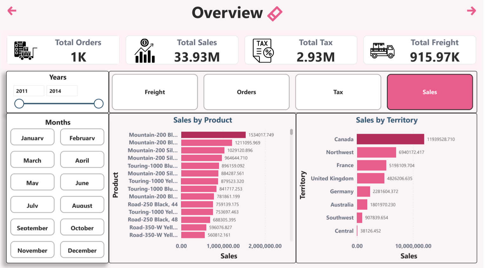
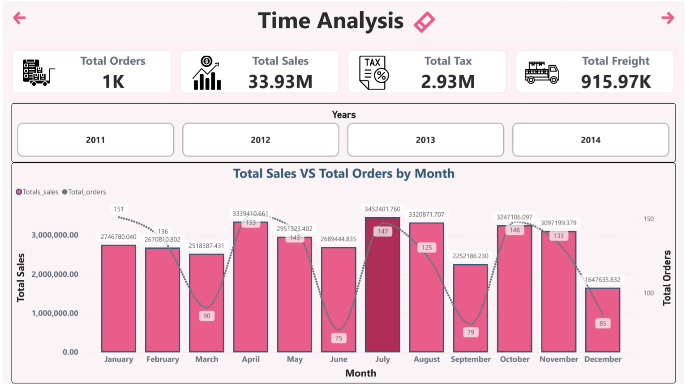
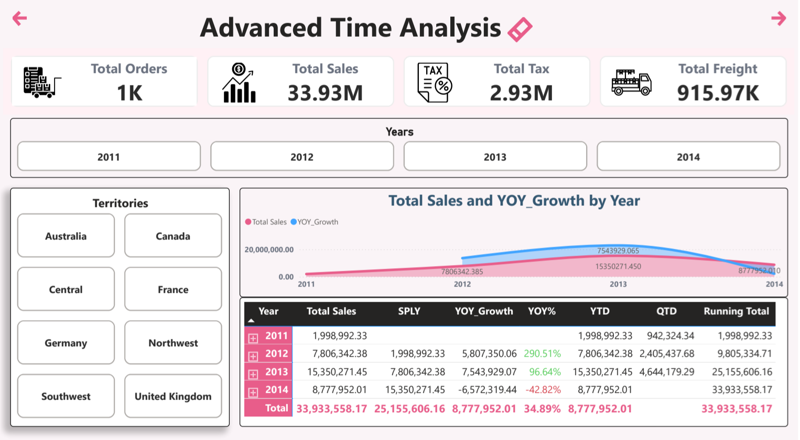
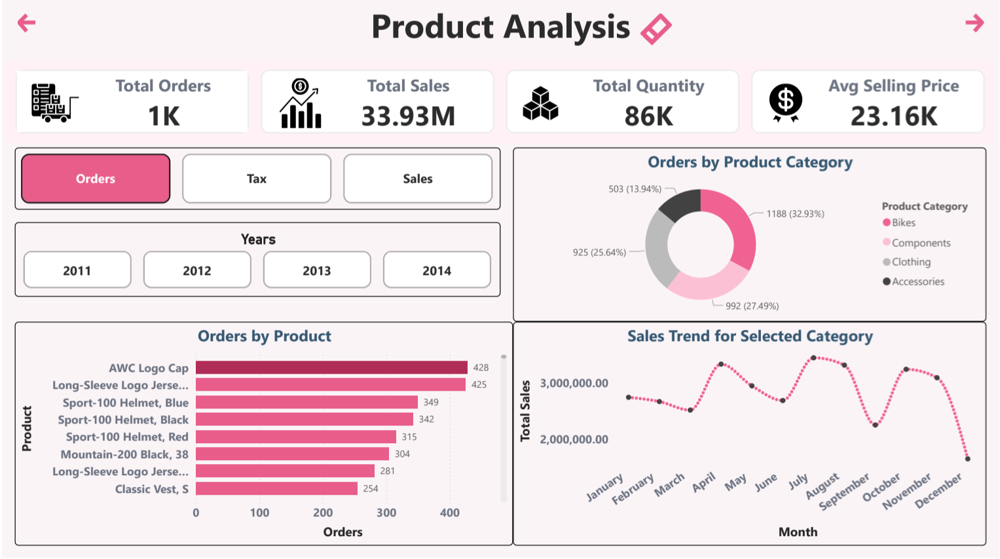
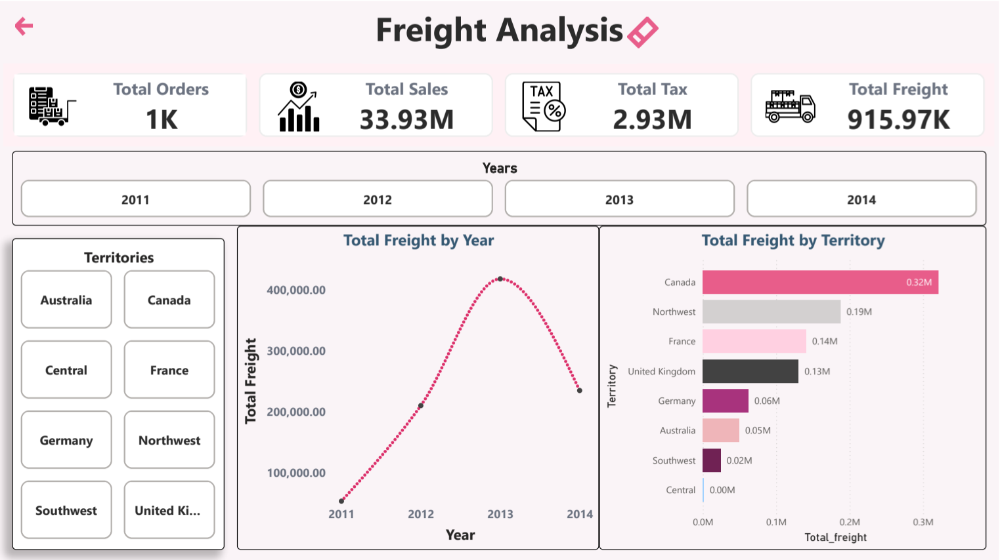

# 📊 Sales Performance & Revenue Insights Dashboard (2011-2014)

## 📌 Project Overview
As part of my ongoing journey in Data Analytics and the **DEPI program**, I built this comprehensive Power BI dashboard to analyze sales performance, track revenue growth, and uncover business-critical trends from 2011 to 2014. 

Coming from a Software Engineering and Frontend background, my goal was not only to perform rigorous data cleaning and modeling but also to design an intuitive, user-friendly interface that makes complex data easy to digest.

## 🚀 Key Business Metrics Highlighted
- **Total Sales:** $33.93M
- **Total Orders:** 1K+
- **Total Tax:** $2.93M
- **Total Freight:** $915.97K

## 🛠️ Technical Pipeline & Tools
- **Data Modeling:** Designed a robust **Star Schema** to connect multiple fact and dimension tables efficiently.
- **DAX (Data Analysis Expressions):** Wrote advanced custom measures to calculate year-over-year growth, precise freight costs, and dynamic time-intelligence metrics.
- **Data Cleaning:** Processed and transformed raw data using Power Query to ensure accuracy.
- **UI/UX Design:** Implemented a clean, professional color palette ( soft purple, and white) to provide a visually engaging and distraction-free experience for stakeholders.

## 💡 Key Insights Uncovered
1. **Geographical Performance:** **Canada** generated the highest sales revenue, leading all other territories.
2. **Product Dominance:** The **Bikes** category, specifically components and Mountain-200 models, represents the largest share of overall orders.
3. **Time Analysis:** The business experienced a major sales peak throughout **2013**, followed by a notable decline in 2014.
4. **Cost Correlation:** Freight costs align directly with the top-performing sales regions, requiring potential supply chain optimization.

## 🖼️ Dashboard Previews

*(📌 Note: Replace the links below with the actual paths to your images)*

### 1. Main Overview

### 2. Time Analysis

### 3. Advanced Time Analysis

### 4. Product & Territory Analysis

### 5. Freight & Territory Analysis

## 📂 Repository Contents
- `sales.pbix`: The main Power BI file containing the data model, DAX measures, and visualizations.
- `Sales_Analysis.pdf`: A static export of the interactive dashboard for quick viewing.
- `Dataset/`: Contains the raw CSV/Excel files used for this analysis.

---
*Feel free to explore the interactive `.pbix` file or reach out if you have any questions about the data modeling or DAX measures used in this project!*
